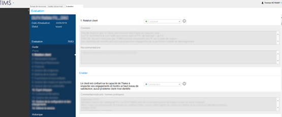

## Introduction

One of the main tasks of this internship topic is the realization of a tool to help writing QAdvices for quality engineers. It intervenes in a context where QAdvices are often neglected, bringing little value. The purpose of the application is therefore to assist its engineers in their decision making by providing them with a maximum of information. We will see in this second part, how the application has been thought and imagined in order to facilitate this task. In a first part, we will see the study of the problem in order to understand the need for QAMs. Then, in a second part, we will see how I approached the learning of the technologies used necessary for the development before approaching the development of the tool. Finally, we will look at the impacts of the work done in the service and how the application will be maintained in the future following my visit.

### Understanding the need

So first I had to know the need for the engineers. Indeed, the engineers have to write a QAdvice for the most critical projects every month. Each QAdvice is made of 14 KMA and for each KMA of the Enablers. Thus, each point requires a comment and a score. This corresponds to about 100 points assessed in each report and to be filled in on the TIMS website (see figure below). This figure shows a KMA with a score, its associated comment and recommendation. Below it is an Enabler with a score and an associated commentary.

 

  

  <i>Figure 1. Actual TIMS inteface's screenshot</i>

