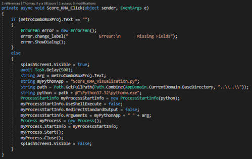
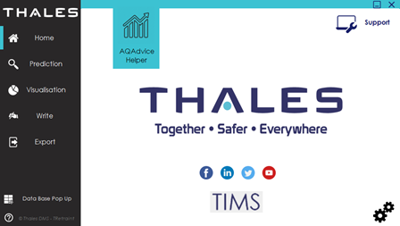
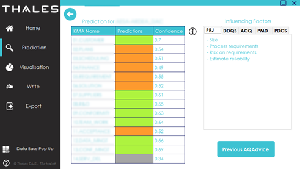
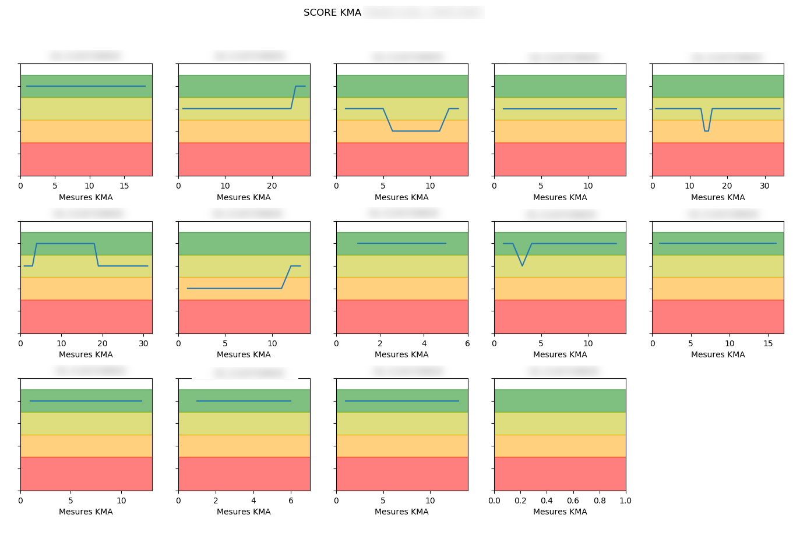
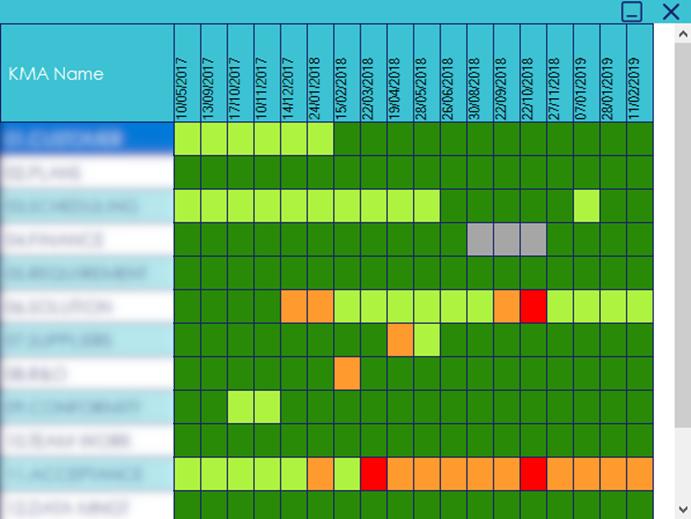
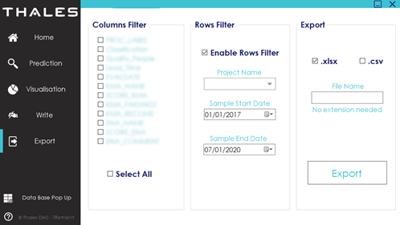

## Introduction

One of the main tasks of this internship topic is the realization of a tool to help writing QAdvices for quality engineers. It intervenes in a context where QAdvices are often neglected, bringing little value. The purpose of the application is therefore to assist its engineers in their decision making by providing them with a maximum of information. We will see in this second part, how the application has been thought and imagined in order to facilitate this task. In a first part, we will see the study of the problem in order to understand the need of the engineers. Then, in a second part, we will see how I approached the learning of the technologies used for the development before approaching the development of the tool. Finally, we will look at the impacts of the work done in the service and how the application will be maintained in the future following my visit.

### Understanding the need

So first I had to know the need for the engineers. Indeed, the engineers have to write a QAdvice for the most critical projects every month. Each QAdvice is made of 14 KMA and for each KMA of the Enablers. Thus, each point requires a comment and a score. This corresponds to about 100 points assessed in each report and to be filled in on the TIMS website (see figure below).TIMS is the name of the database of Thales where they agregate their data. This figure shows a KMA with a score, its associated comment and recommendation. Below it is an Enabler with a score and an associated commentary.

 

  

  <i>Figure 1. Actual TIMS inteface's screenshot</i>

This is therefore a heavy and repetitive task. It is therefore understandable that some points in these reports are poorly or incompletely filled in. It is also noticeable in the dataset that many of the comments remain rather superficial and do not really go into detail. Sometimes the comments can be totally the same as the previous QAdvice.It is therefore necessary to make the engineers aware of the importance of these comments.

For the user experience of the application I interviewed several quality engineers about their expectations of an application that would be at their service. The point that comes up most often is that there is a lack of access to information. Indeed, when reports are submitted to the Thales database, it is complicated for the team to find its information. As this database is a cross-cutting tool for all Thales entities, support for the tool is often rather slow. Simple and intuitive access to information is therefore the key point that this application must embark on.

Another thing that had come back was the lack of relevant dashboards. Dashboards make it easy to visualize information in a synthetic way. The application should also offer different ways of displaying information.

We've now addressed the problem, so we'll move on to learning about the technologies used in another part.

### Training and taking control of the technology

In this part we will focus on training and the tools used to develop the application. 

The use of the C# language was the language in the training course specifications. The advantage of this language is that it is very complete. We find all the concepts of object programming as in C++ for example. It also integrates a framework called .Net allowing the development of graphical programs. What is also a major advantage of this language is its associated IDE: Visual Studio. Visual Studio is an environment also developed by Microsoft allowing to centralize a lot of useful tools for development such as a debugger, Git, a designer tool ...

We also decided to use an Access database for information storage. Access has the advantage of being part of the Office package and is therefore very easily integrated into C# applications. You can make SQL queries in it like in any other database engine.

### Application development

One of the first problems I faced was the integration of Python scripts in an application that is developed in another language. Indeed, the scripts using the machine learning model and therefore the prediction module as well as the whole dataset processing part was developed in Python. The C# language embeds a module called IronPython allowing to develop and execute directly in the application source code the code in Python. The problem with this module is that it doesn't support the import of libraries we used such as Scikit-learn or Pandas. This option was therefore not viable. Another option that would have been possible is the use of the Pythonnet library that integrates the .Net framework under Python. The problem with this method is that this module is designed to create applications intended to be ported to websites and are therefore not usable for a desktop application.

The solution I found is to use the "Diagnostics" module of the "System" library directly integrated into C#. This module allows to execute a python script by calling the path of the file and the interpreter. The advantage of this method is that you can use the standard variable input as an argument as if you were calling a method. One can also retrieve the displays of the Python script executed on the standard output by doing a simple Read of it. Here is an example of a Python script call:

 

  

  <i>Figure 2. Function allowing to execute a Python script with the 'arg' variable as argument.</i>

Here are the home page of the application :

 

  

  <i>Figure 3. Home page of the application.</i>

From here you can access all the features of the application with the menu on the left.
Here are the main features of the application :

  Prediction menu:
 

  

  <i>Figure 4. Predictions interface.</i>

From it, you can select a project and predict the future scores of the KMA of the next QAdvice.

  Visualisation menu:
  

  

  <i>Figure 5. Graph Dashboard.</i>

 

  

  <i>Figure 6. Mosaïque Dashboard.</i>

From it, you can select a project and display severals information of a project.

  Write menu:

From it, you can directly write your QAdvice in a menu. Unfortunately, I'm not allowed to share with you any screenshot of it.

  Export menu:
 

  

  <i>Figure 7. Export menu.</i>

From it, you can export some data to a .csv file.

### After the internship

The application is designed to be ported to any Thales DMS engineering PC. However, as QAdvices is cross-cutting to all Thales, it is widely possible to universalize the porting to all entities of the group. This part of industrialization of the application is not included in the work of this internship. If the use of the application is to be globalized, we can imagine making a version of the application reserved for the different team managers, allowing them to have personalized dashboards on their data.

We can also imagine having a dynamic connection with the TIMS database via an API. This would allow you to retrieve data directly from the source, to be able to write and publish the QAdvice directly on the server. The limits of the application are there. The tool is standalone, but needs to be fed and updated regularly in order to obtain predictions as close as possible to reality. This operation must therefore be done manually for the moment. There is also a restriction on the data format that is imposed. 

## Conclusion

My mission was to create a tool that is easy to access and to put the quality of information at the centre of its use. Translating the needs of an entire team into an application was not a simple task and the rendering seems to be quite successful. The prediction module brings a real added value in the approach that a quality engineer can have towards his project/program. The contribution of an independent point of view allows any quality engineer to question his opinion and his global vision of the project. One can even imagine that the application detects problems that have already occurred historically in previous projects: "better safe than sorry! ».  All that remains is to get feedback from the use of this application in the team.

